# AI Rack — How It Works

Complete technical documentation of the AI Rack application architecture, data flows, and component interactions.

---

## Table of Contents

1. [High-Level Architecture](#high-level-architecture)
2. [Application Startup Flow](#application-startup-flow)
3. [Frontend Architecture](#frontend-architecture)
4. [State Management](#state-management)
5. [Audio Pipeline](#audio-pipeline)
6. [AI Chat System](#ai-chat-system)
7. [Music Engine](#music-engine)
8. [Visualization System](#visualization-system)
9. [Audio-Reactive Bridge](#audio-reactive-bridge)
10. [Knowledge Base System](#knowledge-base-system)
11. [Complete Data Flow](#complete-data-flow)

---

## High-Level Architecture

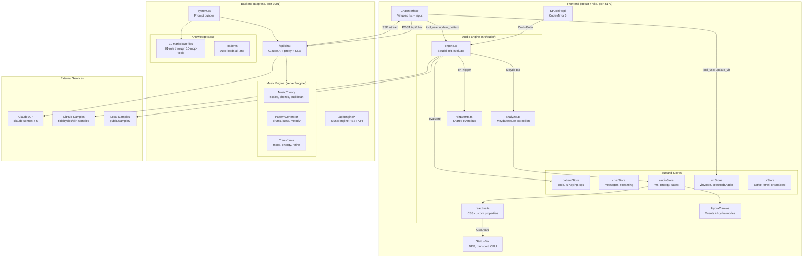
```mermaid
graph TB
    subgraph Frontend ["Frontend (React + Vite, port 5173)"]
        REPL[StrudelRepl<br/>CodeMirror 6]
        VIZ[HydraCanvas<br/>Events + Hydra modes]
        CHAT[ChatInterface<br/>Virtuoso list + input]
        STATUS[StatusBar<br/>BPM, transport, CPU]

        subgraph Stores ["Zustand Stores"]
            PS[patternStore<br/>code, isPlaying, cps]
            CS[chatStore<br/>messages, streaming]
            AS[audioStore<br/>rms, energy, isBeat]
            VS[vizStore<br/>vizMode, selectedShader]
            US[uiStore<br/>activePanel, crtEnabled]
        end

        subgraph Audio ["Audio Engine (src/audio/)"]
            ENGINE[engine.ts<br/>Strudel init, evaluate]
            ANALYZER[analyzer.ts<br/>Meyda feature extraction]
            REACTIVE[reactive.ts<br/>CSS custom properties]
            VIZEVENTS[vizEvents.ts<br/>Shared event bus]
        end
    end

    subgraph Backend ["Backend (Express, port 3001)"]
        CHATROUTE["/api/chat<br/>Claude API proxy + SSE"]
        ENGINEROUTE["/api/engine/*<br/>Music engine REST API"]

        subgraph Engine ["Music Engine (server/engine/)"]
            MT[MusicTheory<br/>scales, chords, euclidean]
            PG[PatternGenerator<br/>drums, bass, melody]
            TR[Transforms<br/>mood, energy, refine]
        end

        subgraph Knowledge ["Knowledge Base"]
            KB["10 markdown files<br/>01-role through 10-mcp-tools"]
            LOADER[loader.ts<br/>Auto-loads all .md]
        end

        SYSTEM[system.ts<br/>Prompt builder]
    end

    subgraph External ["External Services"]
        CLAUDE[Claude API<br/>claude-sonnet-4-6]
        SAMPLES[GitHub Samples<br/>tidalcycles/dirt-samples]
        LOCAL[Local Samples<br/>public/samples/]
    end

    REPL -->|Cmd+Enter| ENGINE
    ENGINE -->|evaluate| PS
    ENGINE -->|onTrigger| VIZEVENTS
    ENGINE -->|Meyda tap| ANALYZER
    ANALYZER --> AS
    AS --> REACTIVE
    AS --> VIZ
    REACTIVE -->|CSS vars| STATUS

    CHAT -->|POST /api/chat| CHATROUTE
    CHATROUTE -->|SSE stream| CHAT
    CHATROUTE --> CLAUDE
    CHATROUTE --> Engine

    CHAT -->|tool_use: update_pattern| ENGINE
    CHAT -->|tool_use: update_viz| VS

    SYSTEM --> KB
    SYSTEM --> CHATROUTE

    ENGINE --> SAMPLES
    ENGINE --> LOCAL
```

---

## Application Startup Flow

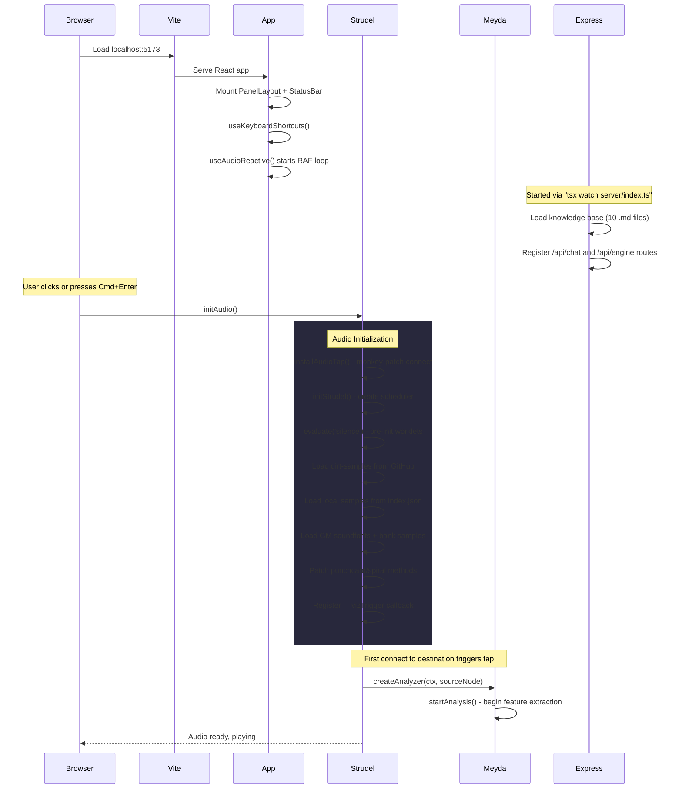
```mermaid
sequenceDiagram
    participant Browser
    participant Vite
    participant App
    participant Strudel
    participant Meyda
    participant Express

    Browser->>Vite: Load localhost:5173
    Vite->>App: Serve React app
    App->>App: Mount PanelLayout + StatusBar
    App->>App: useKeyboardShortcuts()
    App->>App: useAudioReactive() starts RAF loop

    Note over Express: Started via "tsx watch server/index.ts"
    Express->>Express: Load knowledge base (10 .md files)
    Express->>Express: Register /api/chat and /api/engine routes

    Note over Browser: User clicks or presses Cmd+Enter
    Browser->>Strudel: initAudio()

    rect rgb(40, 40, 60)
        Note over Strudel: Audio Initialization
        Strudel->>Strudel: installAudioTap() - monkey-patch connect
        Strudel->>Strudel: initStrudel() - create scheduler
        Strudel->>Strudel: evaluate('silence') - pre-init worklets
        Strudel->>Strudel: Load dirt-samples from GitHub
        Strudel->>Strudel: Load local samples from index.json
        Strudel->>Strudel: Load GM soundfonts + bank samples
        Strudel->>Strudel: Patch punchcard/spiral methods
        Strudel->>Strudel: Register __vizTrigger callback
    end

    Note over Strudel, Meyda: First connect to destination triggers tap
    Strudel->>Meyda: createAnalyzer(ctx, sourceNode)
    Meyda->>Meyda: startAnalysis() - begin feature extraction

    Strudel-->>Browser: Audio ready, playing
```

---

## Frontend Architecture

### Component Tree


```mermaid
graph TD
    APP["App.tsx"]
    APP --> PL["PanelLayout<br/>react-resizable-panels"]
    APP --> SB["StatusBar<br/>BPM, key, transport"]

    PL --> SR["StrudelRepl<br/>CodeMirror 6 editor"]
    PL --> HC["HydraCanvas<br/>Dual-mode visualization"]
    PL --> CI["ChatInterface<br/>Message list + input"]

    SR --> US["useStrudel hook<br/>evaluate on Cmd+Enter"]

    HC --> UH["useHydra hook<br/>Hydra synth instance"]
    HC --> VC["VizControls<br/>Shader preset dropdown"]
    HC --> EC["Events Canvas<br/>Canvas 2D lane viz"]
    HC --> HYC["Hydra Canvas<br/>WebGL shader output"]

    CI --> CIN["ChatInput<br/>λ> prompt + history"]
    CI --> CML["ChatMessage list<br/>React Virtuoso"]
    CI --> CB["CodeBlock<br/>Syntax highlight + inject"]
    CI --> STT["useSpeechToText<br/>Microphone input"]

    style APP fill:#1a1a2e
    style PL fill:#12121a
    style SR fill:#0a3a0a
    style HC fill:#0a0a3a
    style CI fill:#2a0a2a
```

### Panel Layout

The app uses `react-resizable-panels` for a 3-panel layout:

| Panel | Component | Purpose |
|-------|-----------|---------|
| Left | `StrudelRepl` | CodeMirror 6 editor for Strudel live coding |
| Center | `HydraCanvas` | Visualization (Events canvas or Hydra shaders) |
| Right | `ChatInterface` | AI chat with message history and code injection |

---

## State Management

All state flows through 5 Zustand stores. Stores are accessible from both React components and imperative code (audio callbacks).

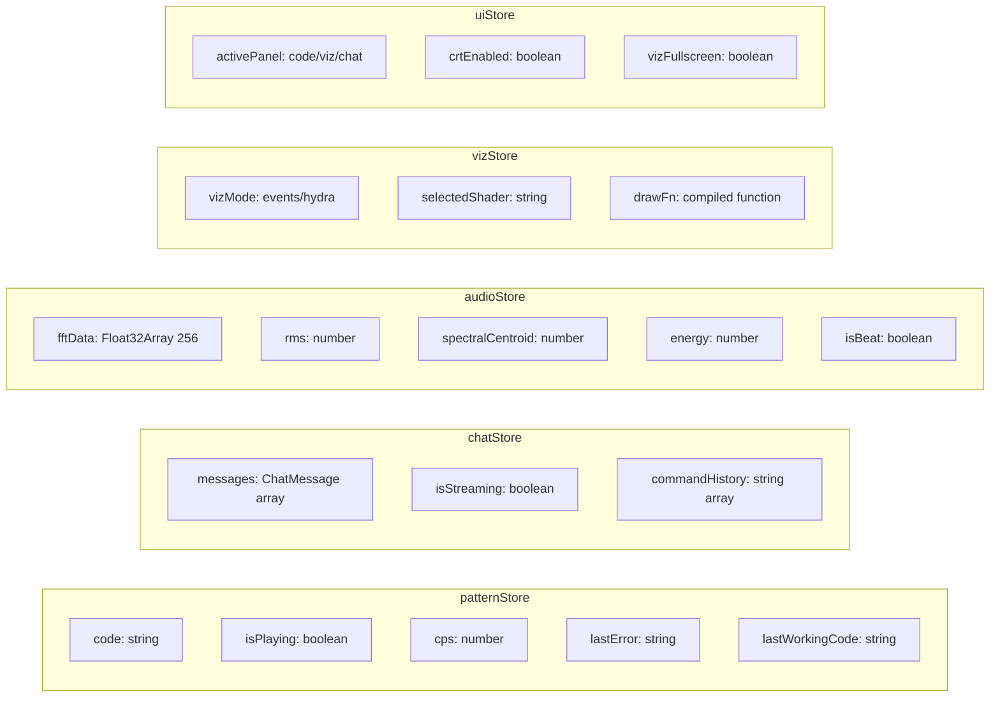
```mermaid
graph LR
    subgraph patternStore
        CODE[code: string]
        PLAYING[isPlaying: boolean]
        CPS[cps: number]
        ERROR[lastError: string]
        LWC[lastWorkingCode: string]
    end

    subgraph chatStore
        MSGS[messages: ChatMessage array]
        STREAM[isStreaming: boolean]
        HIST[commandHistory: string array]
    end

    subgraph audioStore
        FFT[fftData: Float32Array 256]
        RMS[rms: number]
        SC[spectralCentroid: number]
        ENERGY[energy: number]
        BEAT[isBeat: boolean]
    end

    subgraph vizStore
        VMODE[vizMode: events/hydra]
        SHADER[selectedShader: string]
        DRAWFN[drawFn: compiled function]
    end

    subgraph uiStore
        PANEL[activePanel: code/viz/chat]
        CRT[crtEnabled: boolean]
        VFULL[vizFullscreen: boolean]
    end
```

### Store Data Flow

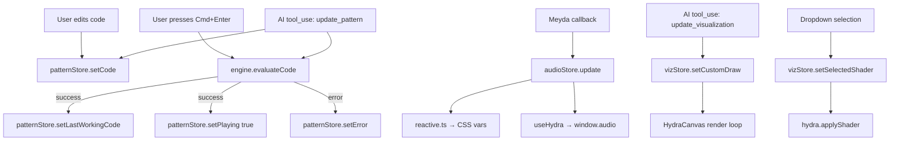
```mermaid
flowchart TD
    USER_EDIT[User edits code] --> PS_CODE[patternStore.setCode]
    CMD_ENTER[User presses Cmd+Enter] --> EVAL[engine.evaluateCode]
    EVAL -->|success| PS_LWC[patternStore.setLastWorkingCode]
    EVAL -->|success| PS_PLAY[patternStore.setPlaying true]
    EVAL -->|error| PS_ERR[patternStore.setError]

    AI_TOOL[AI tool_use: update_pattern] --> PS_CODE
    AI_TOOL --> EVAL

    MEYDA[Meyda callback] --> AS_UPDATE[audioStore.update]
    AS_UPDATE --> REACTIVE_CSS["reactive.ts → CSS vars"]
    AS_UPDATE --> HYDRA_BRIDGE["useHydra → window.audio"]

    AI_VIZ[AI tool_use: update_visualization] --> VS_DRAW[vizStore.setCustomDraw]
    VS_DRAW --> VIZ_RENDER[HydraCanvas render loop]

    SHADER_SELECT[Dropdown selection] --> VS_SHADER[vizStore.setSelectedShader]
    VS_SHADER --> HYDRA_APPLY[hydra.applyShader]
```

---

## Audio Pipeline


```mermaid
flowchart TD
    CODE["Strudel code string<br/>(from REPL or AI)"]
    CODE --> TRANSPILE["Transpiler<br/>mini-notation → JS"]
    TRANSPILE --> PATTERN["Pattern Object<br/>.queryArc() callable"]
    PATTERN --> SCHEDULER["Scheduler<br/>polls every ~50ms"]

    SCHEDULER --> QUERY["queryArc(start, end)<br/>get events for time window"]
    QUERY --> SUPERDOUGH["superdough<br/>Web Audio synthesis"]

    SUPERDOUGH --> DEST["AudioDestination<br/>Speakers"]
    SUPERDOUGH --> TAP["Meyda Tap<br/>(parallel, no audio impact)"]

    TAP --> ANALYSER["AnalyserNode<br/>FFT size 512"]
    ANALYSER --> MEYDA["Meyda Analyzer<br/>rms, spectralCentroid, energy"]
    MEYDA --> BEAT_DETECT{"energy > 1.5x<br/>rolling average?"}
    BEAT_DETECT -->|yes| BEAT_TRUE["isBeat = true"]
    BEAT_DETECT -->|no| BEAT_FALSE["isBeat = false"]

    MEYDA --> AUDIO_STORE["audioStore.update()"]
    BEAT_TRUE --> AUDIO_STORE
    BEAT_FALSE --> AUDIO_STORE

    SCHEDULER --> VIZ_TRIGGER["__vizTrigger callback<br/>onTrigger per hap"]
    VIZ_TRIGGER --> VIZ_EVENTS["vizEvents array<br/>s, gain, duration, note, etc."]

    style CODE fill:#2a2a0a
    style SUPERDOUGH fill:#0a2a0a
    style MEYDA fill:#0a0a2a
    style VIZ_EVENTS fill:#2a0a2a
```

### Hot-Swap Mechanism

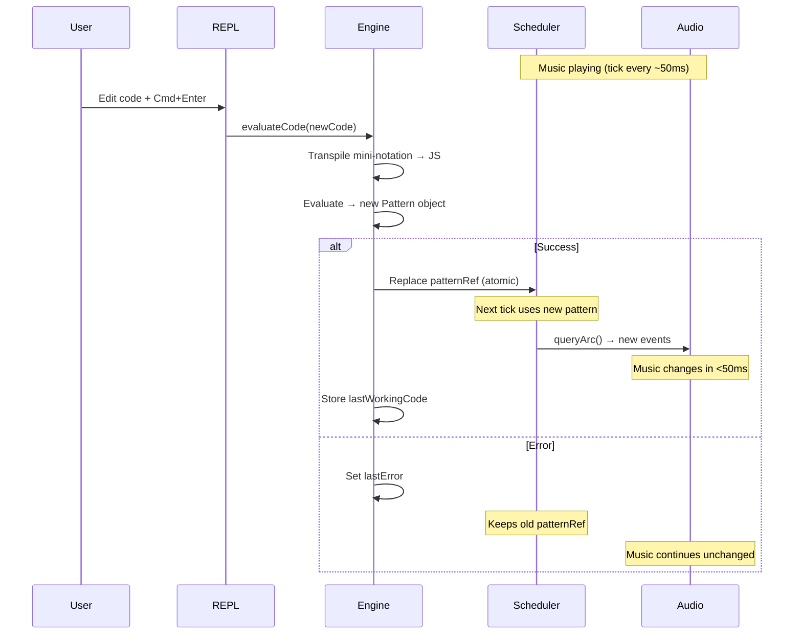
```mermaid
sequenceDiagram
    participant User
    participant REPL
    participant Engine
    participant Scheduler
    participant Audio

    Note over Scheduler, Audio: Music playing (tick every ~50ms)

    User->>REPL: Edit code + Cmd+Enter
    REPL->>Engine: evaluateCode(newCode)
    Engine->>Engine: Transpile mini-notation → JS
    Engine->>Engine: Evaluate → new Pattern object

    alt Success
        Engine->>Scheduler: Replace patternRef (atomic)
        Note over Scheduler: Next tick uses new pattern
        Scheduler->>Audio: queryArc() → new events
        Note over Audio: Music changes in <50ms
        Engine->>Engine: Store lastWorkingCode
    else Error
        Engine->>Engine: Set lastError
        Note over Scheduler: Keeps old patternRef
        Note over Audio: Music continues unchanged
    end
```

### Audio Analyzer Connection

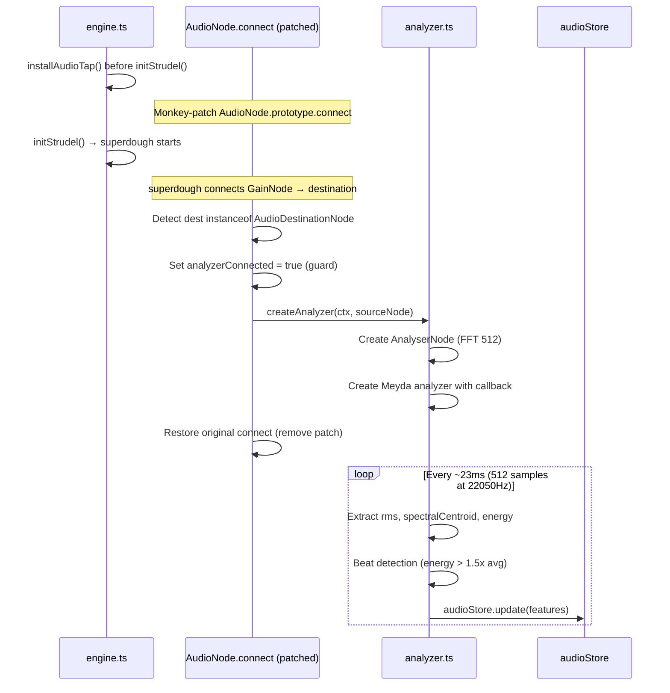
```mermaid
sequenceDiagram
    participant Engine as engine.ts
    participant Connect as AudioNode.connect (patched)
    participant Meyda as analyzer.ts
    participant Store as audioStore

    Engine->>Engine: installAudioTap() before initStrudel()
    Note over Connect: Monkey-patch AudioNode.prototype.connect

    Engine->>Engine: initStrudel() → superdough starts
    Note over Connect: superdough connects GainNode → destination

    Connect->>Connect: Detect dest instanceof AudioDestinationNode
    Connect->>Connect: Set analyzerConnected = true (guard)
    Connect->>Meyda: createAnalyzer(ctx, sourceNode)
    Meyda->>Meyda: Create AnalyserNode (FFT 512)
    Meyda->>Meyda: Create Meyda analyzer with callback
    Connect->>Connect: Restore original connect (remove patch)

    loop Every ~23ms (512 samples at 22050Hz)
        Meyda->>Meyda: Extract rms, spectralCentroid, energy
        Meyda->>Meyda: Beat detection (energy > 1.5x avg)
        Meyda->>Store: audioStore.update(features)
    end
```

---

## AI Chat System

### Chat Request Flow

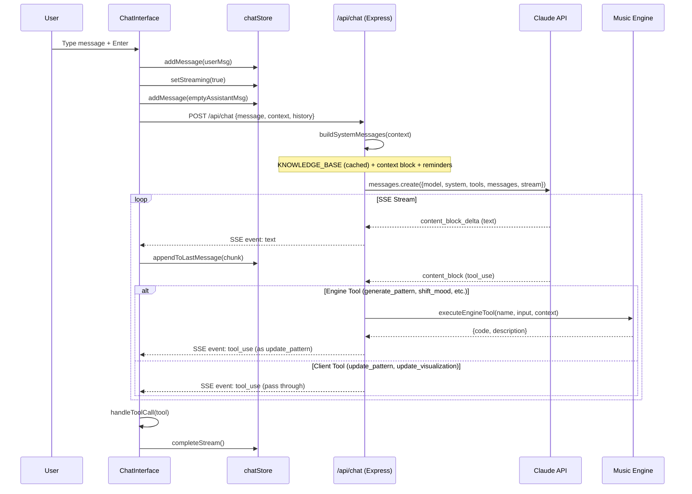
```mermaid
sequenceDiagram
    participant User
    participant ChatUI as ChatInterface
    participant ChatStore as chatStore
    participant API as /api/chat (Express)
    participant Claude as Claude API
    participant Engine as Music Engine

    User->>ChatUI: Type message + Enter
    ChatUI->>ChatStore: addMessage(userMsg)
    ChatUI->>ChatStore: setStreaming(true)
    ChatUI->>ChatStore: addMessage(emptyAssistantMsg)

    ChatUI->>API: POST /api/chat {message, context, history}

    API->>API: buildSystemMessages(context)
    Note over API: KNOWLEDGE_BASE (cached) + context block + reminders

    API->>Claude: messages.create({model, system, tools, messages, stream})

    loop SSE Stream
        Claude-->>API: content_block_delta (text)
        API-->>ChatUI: SSE event: text
        ChatUI->>ChatStore: appendToLastMessage(chunk)

        Claude-->>API: content_block (tool_use)

        alt Engine Tool (generate_pattern, shift_mood, etc.)
            API->>Engine: executeEngineTool(name, input, context)
            Engine-->>API: {code, description}
            API-->>ChatUI: SSE event: tool_use (as update_pattern)
        else Client Tool (update_pattern, update_visualization)
            API-->>ChatUI: SSE event: tool_use (pass through)
        end
    end

    ChatUI->>ChatUI: handleToolCall(tool)
    ChatUI->>ChatStore: completeStream()
```

### Tool Execution

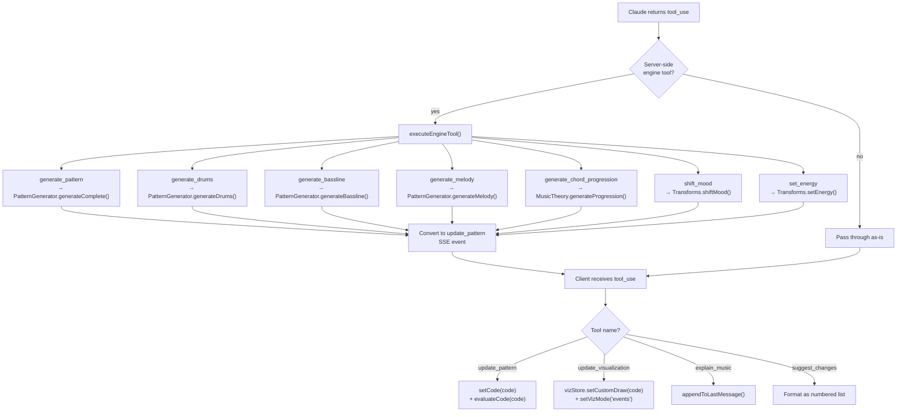
```mermaid
flowchart TD
    TOOL["Claude returns tool_use"]

    TOOL --> IS_ENGINE{"Server-side<br/>engine tool?"}

    IS_ENGINE -->|yes| EXEC["executeEngineTool()"]
    EXEC --> GEN_PAT["generate_pattern<br/>→ PatternGenerator.generateComplete()"]
    EXEC --> GEN_DRUM["generate_drums<br/>→ PatternGenerator.generateDrums()"]
    EXEC --> GEN_BASS["generate_bassline<br/>→ PatternGenerator.generateBassline()"]
    EXEC --> GEN_MEL["generate_melody<br/>→ PatternGenerator.generateMelody()"]
    EXEC --> GEN_CHORD["generate_chord_progression<br/>→ MusicTheory.generateProgression()"]
    EXEC --> MOOD["shift_mood<br/>→ Transforms.shiftMood()"]
    EXEC --> ENERGY["set_energy<br/>→ Transforms.setEnergy()"]

    GEN_PAT --> CONVERT["Convert to update_pattern<br/>SSE event"]
    GEN_DRUM --> CONVERT
    GEN_BASS --> CONVERT
    GEN_MEL --> CONVERT
    GEN_CHORD --> CONVERT
    MOOD --> CONVERT
    ENERGY --> CONVERT

    IS_ENGINE -->|no| PASSTHRU["Pass through as-is"]

    CONVERT --> CLIENT["Client receives tool_use"]
    PASSTHRU --> CLIENT

    CLIENT --> UP{"Tool name?"}
    UP -->|update_pattern| SET_CODE["setCode(code)<br/>+ evaluateCode(code)"]
    UP -->|update_visualization| SET_VIZ["vizStore.setCustomDraw(code)<br/>+ setVizMode('events')"]
    UP -->|explain_music| APPEND["appendToLastMessage()"]
    UP -->|suggest_changes| FORMAT["Format as numbered list"]
```

---

## Music Engine

### Module Architecture

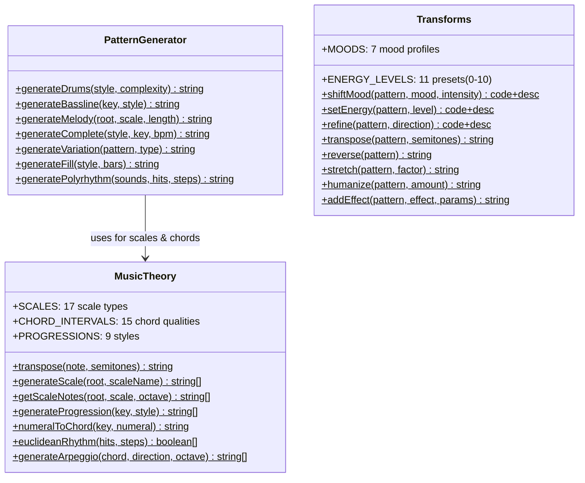
```mermaid
classDiagram
    class MusicTheory {
        +SCALES: 17 scale types
        +CHORD_INTERVALS: 15 chord qualities
        +PROGRESSIONS: 9 styles
        +transpose(note, semitones)$ string
        +generateScale(root, scaleName)$ string[]
        +getScaleNotes(root, scale, octave)$ string[]
        +generateProgression(key, style)$ string[]
        +numeralToChord(key, numeral)$ string
        +euclideanRhythm(hits, steps)$ boolean[]
        +generateArpeggio(chord, direction, octave)$ string[]
    }

    class PatternGenerator {
        +generateDrums(style, complexity)$ string
        +generateBassline(key, style)$ string
        +generateMelody(root, scale, length)$ string
        +generateComplete(style, key, bpm)$ string
        +generateVariation(pattern, type)$ string
        +generateFill(style, bars)$ string
        +generatePolyrhythm(sounds, hits, steps)$ string
    }

    class Transforms {
        +MOODS: 7 mood profiles
        +ENERGY_LEVELS: 11 presets (0-10)
        +shiftMood(pattern, mood, intensity)$ code+desc
        +setEnergy(pattern, level)$ code+desc
        +refine(pattern, direction)$ code+desc
        +transpose(pattern, semitones)$ string
        +reverse(pattern)$ string
        +stretch(pattern, factor)$ string
        +humanize(pattern, amount)$ string
        +addEffect(pattern, effect, params)$ string
    }

    PatternGenerator --> MusicTheory : uses for scales & chords
```

### Available Styles and Options

| Category | Options |
|----------|---------|
| **Drum Styles** | techno, house, dnb, trap, breakbeat, ambient, boom_bap, trip_hop, experimental |
| **Bass Styles** | techno, house, dnb, acid, dub, funk, ambient, trip_hop, boom_bap |
| **Scales** | major, minor, dorian, phrygian, lydian, mixolydian, aeolian, locrian, minor_pentatonic, major_pentatonic, blues, chromatic, whole_tone, harmonic_minor, melodic_minor, diminished, bebop |
| **Progressions** | pop, jazz, blues, soul, edm, lofi, rock, classical, dark |
| **Moods** | dark, euphoric, melancholic, aggressive, dreamy, peaceful, energetic |
| **Energy** | 0 (ambient) → 5 (normal) → 10 (maximum) |
| **Refinements** | faster, slower, louder, quieter, brighter, darker, more reverb, drier, more delay, more swing, distorted |

---

## Visualization System

### Dual-Mode Architecture

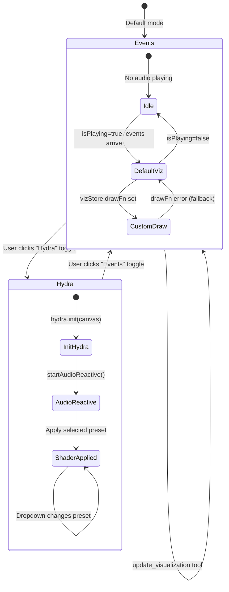
```mermaid
stateDiagram-v2
    [*] --> Events : Default mode

    state Events {
        [*] --> Idle : No audio playing
        Idle --> DefaultViz : isPlaying=true, events arrive
        DefaultViz --> CustomDraw : vizStore.drawFn set
        CustomDraw --> DefaultViz : drawFn error (fallback)
        DefaultViz --> Idle : isPlaying=false
    }

    Events --> Hydra : User clicks "Hydra" toggle

    state Hydra {
        [*] --> InitHydra : hydra.init(canvas)
        InitHydra --> AudioReactive : startAudioReactive()
        AudioReactive --> ShaderApplied : Apply selected preset
        ShaderApplied --> ShaderApplied : Dropdown changes preset
    }

    Hydra --> Events : User clicks "Events" toggle
    Events --> Events : update_visualization tool
```

### Events Mode Rendering

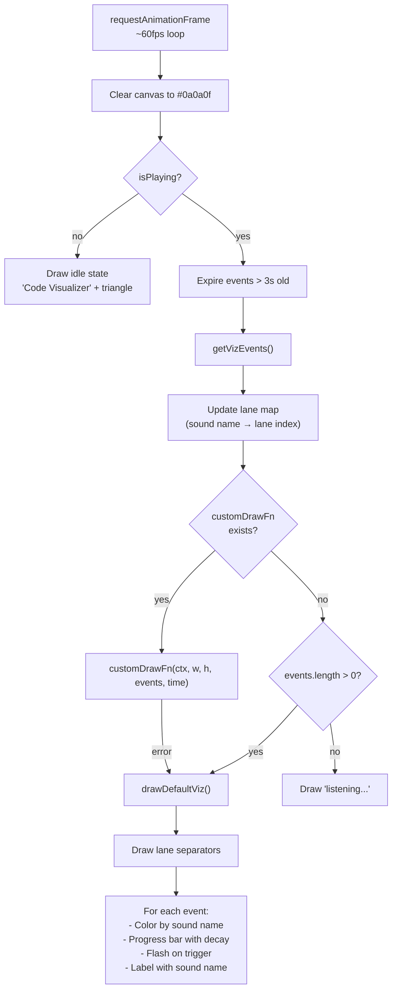
```mermaid
flowchart TD
    RAF["requestAnimationFrame<br/>~60fps loop"]
    RAF --> CLEAR["Clear canvas to #0a0a0f"]
    CLEAR --> PLAYING{"isPlaying?"}

    PLAYING -->|no| IDLE["Draw idle state<br/>'Code Visualizer' + triangle"]

    PLAYING -->|yes| EXPIRE["Expire events > 3s old"]
    EXPIRE --> GET_EVENTS["getVizEvents()"]
    GET_EVENTS --> UPDATE_LANES["Update lane map<br/>(sound name → lane index)"]

    UPDATE_LANES --> HAS_CUSTOM{"customDrawFn<br/>exists?"}

    HAS_CUSTOM -->|yes| CUSTOM["customDrawFn(ctx, w, h, events, time)"]
    CUSTOM -->|error| DEFAULT

    HAS_CUSTOM -->|no| HAS_EVENTS{"events.length > 0?"}
    HAS_EVENTS -->|no| LISTENING["Draw 'listening...'"]
    HAS_EVENTS -->|yes| DEFAULT["drawDefaultViz()"]

    DEFAULT --> LANES["Draw lane separators"]
    LANES --> BARS["For each event:<br/>- Color by sound name<br/>- Progress bar with decay<br/>- Flash on trigger<br/>- Label with sound name"]
```

### Hydra Audio Bridge

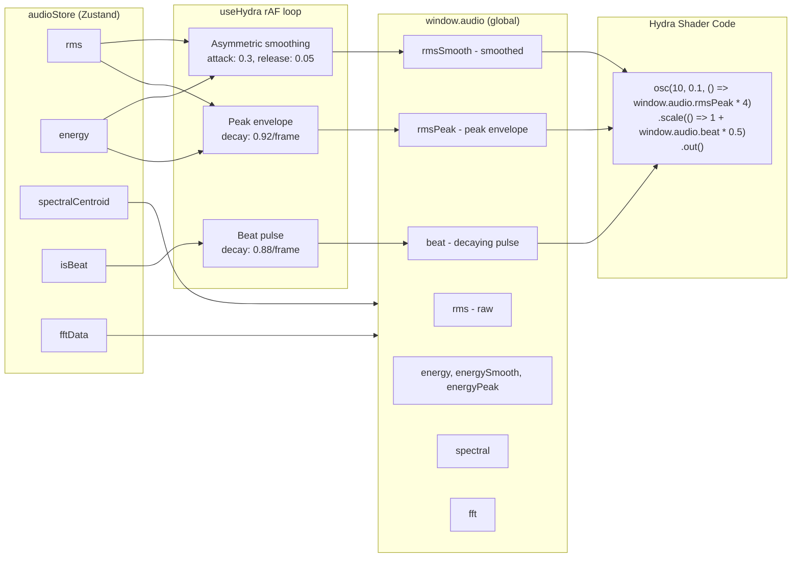
```mermaid
flowchart LR
    subgraph audioStore ["audioStore (Zustand)"]
        RMS[rms]
        ENERGY[energy]
        SC[spectralCentroid]
        BEAT[isBeat]
        FFT[fftData]
    end

    subgraph useHydra ["useHydra rAF loop"]
        SMOOTH["Asymmetric smoothing<br/>attack: 0.3, release: 0.05"]
        PEAK["Peak envelope<br/>decay: 0.92/frame"]
        BEAT_DECAY["Beat pulse<br/>decay: 0.88/frame"]
    end

    subgraph windowAudio ["window.audio (global)"]
        WA_RMS[rms - raw]
        WA_SMOOTH[rmsSmooth - smoothed]
        WA_PEAK[rmsPeak - peak envelope]
        WA_BEAT[beat - decaying pulse]
        WA_ENERGY[energy, energySmooth, energyPeak]
        WA_SPECTRAL[spectral]
        WA_FFT[fft]
    end

    subgraph Hydra ["Hydra Shader Code"]
        SHADER["osc(10, 0.1, () => window.audio.rmsPeak * 4)<br/>.scale(() => 1 + window.audio.beat * 0.5)<br/>.out()"]
    end

    RMS --> SMOOTH
    RMS --> PEAK
    ENERGY --> SMOOTH
    ENERGY --> PEAK
    BEAT --> BEAT_DECAY
    SC --> windowAudio
    FFT --> windowAudio

    SMOOTH --> WA_SMOOTH
    PEAK --> WA_PEAK
    BEAT_DECAY --> WA_BEAT

    WA_PEAK --> SHADER
    WA_BEAT --> SHADER
    WA_SMOOTH --> SHADER
```

---

## Audio-Reactive Bridge

Two parallel paths carry audio data to the UI:

### Path 1: CSS Custom Properties (for UI chrome)

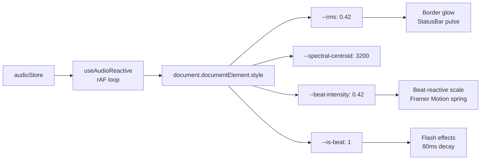
```mermaid
flowchart LR
    AS[audioStore] --> RAF["useAudioReactive<br/>rAF loop"]
    RAF --> CSS["document.documentElement.style"]
    CSS --> VAR_RMS["--rms: 0.42"]
    CSS --> VAR_SC["--spectral-centroid: 3200"]
    CSS --> VAR_BEAT["--beat-intensity: 0.42"]
    CSS --> VAR_IS["--is-beat: 1"]

    VAR_RMS --> UI_GLOW["Border glow<br/>StatusBar pulse"]
    VAR_BEAT --> UI_SCALE["Beat-reactive scale<br/>Framer Motion spring"]
    VAR_IS --> UI_FLASH["Flash effects<br/>80ms decay"]
```

### Path 2: window.audio Global (for Hydra shaders)

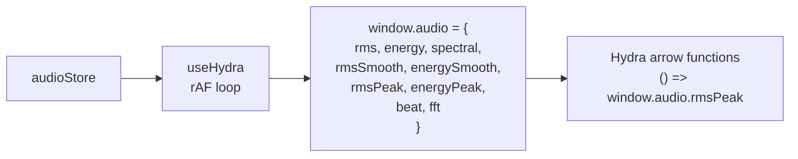
```mermaid
flowchart LR
    AS[audioStore] --> UH["useHydra<br/>rAF loop"]
    UH --> WA["window.audio = {<br/>  rms, energy, spectral,<br/>  rmsSmooth, energySmooth,<br/>  rmsPeak, energyPeak,<br/>  beat, fft<br/>}"]
    WA --> HYDRA["Hydra arrow functions<br/>() => window.audio.rmsPeak"]
```

---

## Knowledge Base System

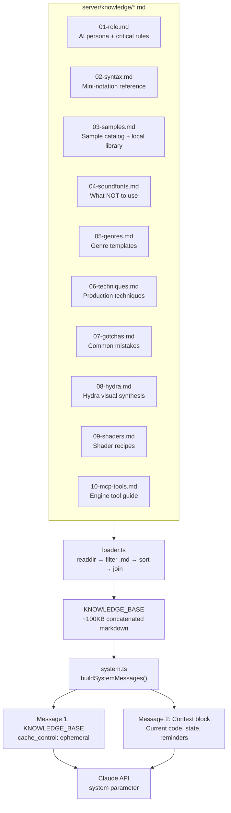
```mermaid
flowchart TD
    subgraph Files ["server/knowledge/*.md"]
        F01["01-role.md<br/>AI persona + critical rules"]
        F02["02-syntax.md<br/>Mini-notation reference"]
        F03["03-samples.md<br/>Sample catalog + local library"]
        F04["04-soundfonts.md<br/>What NOT to use"]
        F05["05-genres.md<br/>Genre templates"]
        F06["06-techniques.md<br/>Production techniques"]
        F07["07-gotchas.md<br/>Common mistakes"]
        F08["08-hydra.md<br/>Hydra visual synthesis"]
        F09["09-shaders.md<br/>Shader recipes"]
        F10["10-mcp-tools.md<br/>Engine tool guide"]
    end

    Files --> LOADER["loader.ts<br/>readdir → filter .md → sort → join"]
    LOADER --> KB["KNOWLEDGE_BASE<br/>~100KB concatenated markdown"]

    KB --> SYSTEM["system.ts<br/>buildSystemMessages()"]
    SYSTEM --> MSG1["Message 1: KNOWLEDGE_BASE<br/>cache_control: ephemeral"]
    SYSTEM --> MSG2["Message 2: Context block<br/>Current code, state, reminders"]

    MSG1 --> CLAUDE["Claude API<br/>system parameter"]
    MSG2 --> CLAUDE
```

### System Prompt Structure

```
┌─────────────────────────────────────────┐
│ System Message 1 (cached, ~100KB)       │
│                                         │
│ 01-role.md: Persona + 9 critical rules  │
│ 02-syntax.md: Mini-notation reference   │
│ 03-samples.md: All available samples    │
│ 04-soundfonts.md: Forbidden sounds      │
│ 05-genres.md: Genre templates           │
│ 06-techniques.md: Production tips       │
│ 07-gotchas.md: Common mistakes          │
│ 08-hydra.md: Visual synthesis guide     │
│ 09-shaders.md: Shader recipes           │
│ 10-mcp-tools.md: Engine tools guide     │
├─────────────────────────────────────────┤
│ System Message 2 (dynamic, per-request) │
│                                         │
│ Current Session State:                  │
│   - Playing: true/false                 │
│   - Tempo: 0.5 CPS (120 BPM)          │
│   - Current Code: ```js ... ```         │
│   - Last Error (if any)                 │
│                                         │
│ Visualization API Reference             │
│                                         │
│ Reminders:                              │
│   1. Always include existing code       │
│   2. Never remove user's layers         │
│   3. setcps() standalone                │
│   4. Last expression plays              │
│   5. Use update_visualization for viz   │
│   6. Supported chord types only         │
└─────────────────────────────────────────┘
```

---

## Complete Data Flow

### User Types in Chat: "Add a bassline"

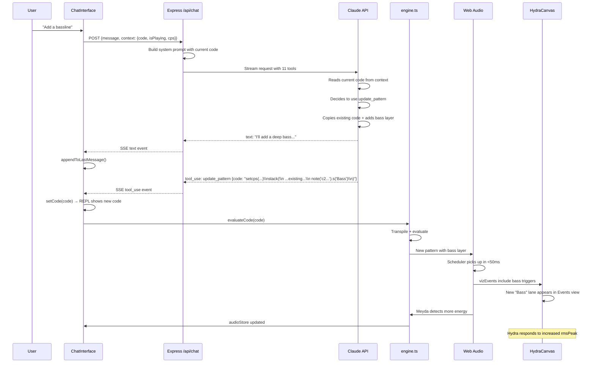
```mermaid
sequenceDiagram
    participant User
    participant Chat as ChatInterface
    participant Server as Express /api/chat
    participant Claude as Claude API
    participant Engine as engine.ts
    participant Audio as Web Audio
    participant Viz as HydraCanvas

    User->>Chat: "Add a bassline"
    Chat->>Server: POST {message, context: {code, isPlaying, cps}}
    Server->>Server: Build system prompt with current code
    Server->>Claude: Stream request with 11 tools

    Claude->>Claude: Reads current code from context
    Claude->>Claude: Decides to use update_pattern
    Claude->>Claude: Copies existing code + adds bass layer

    Claude-->>Server: text: "I'll add a deep bass..."
    Server-->>Chat: SSE text event
    Chat->>Chat: appendToLastMessage()

    Claude-->>Server: tool_use: update_pattern {code: "setcps(...)\\nstack(\\n  ...existing...\\n  note('c2...').s('Bass')\\n)"}
    Server-->>Chat: SSE tool_use event

    Chat->>Chat: setCode(code) → REPL shows new code
    Chat->>Engine: evaluateCode(code)
    Engine->>Engine: Transpile + evaluate
    Engine->>Audio: New pattern with bass layer
    Audio->>Audio: Scheduler picks up in <50ms

    Audio->>Viz: vizEvents include bass triggers
    Viz->>Viz: New "Bass" lane appears in Events view

    Audio->>Engine: Meyda detects more energy
    Engine->>Chat: audioStore updated
    Note over Viz: Hydra responds to increased rmsPeak
```

### User Switches to Hydra Mode

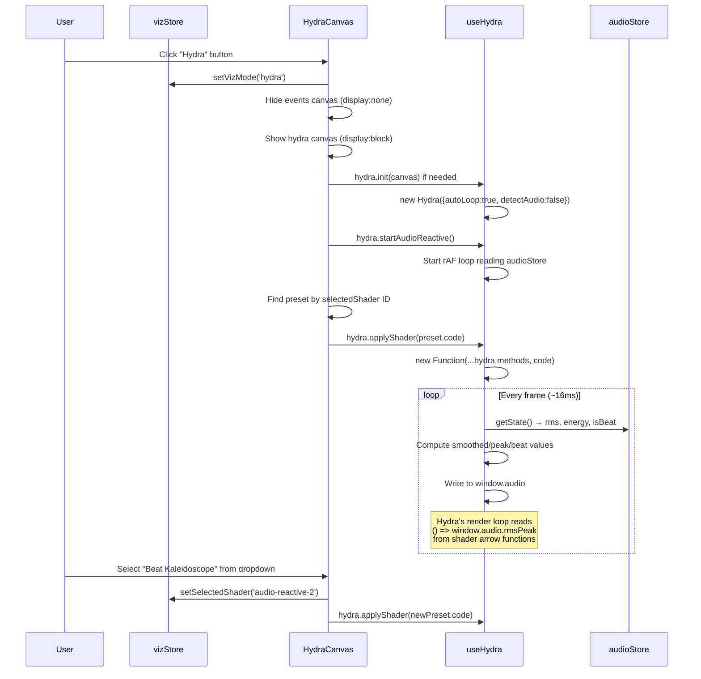
```mermaid
sequenceDiagram
    participant User
    participant VizStore as vizStore
    participant Canvas as HydraCanvas
    participant Hydra as useHydra
    participant AudioStore as audioStore

    User->>Canvas: Click "Hydra" button
    Canvas->>VizStore: setVizMode('hydra')

    Canvas->>Canvas: Hide events canvas (display:none)
    Canvas->>Canvas: Show hydra canvas (display:block)

    Canvas->>Hydra: hydra.init(canvas) if needed
    Hydra->>Hydra: new Hydra({autoLoop:true, detectAudio:false})

    Canvas->>Hydra: hydra.startAudioReactive()
    Hydra->>Hydra: Start rAF loop reading audioStore

    Canvas->>Canvas: Find preset by selectedShader ID
    Canvas->>Hydra: hydra.applyShader(preset.code)
    Hydra->>Hydra: new Function(...hydra methods, code)

    loop Every frame (~16ms)
        Hydra->>AudioStore: getState() → rms, energy, isBeat
        Hydra->>Hydra: Compute smoothed/peak/beat values
        Hydra->>Hydra: Write to window.audio
        Note over Hydra: Hydra's render loop reads<br/>() => window.audio.rmsPeak<br/>from shader arrow functions
    end

    User->>Canvas: Select "Beat Kaleidoscope" from dropdown
    Canvas->>VizStore: setSelectedShader('audio-reactive-2')
    Canvas->>Hydra: hydra.applyShader(newPreset.code)
```

---

## Local Sample Library

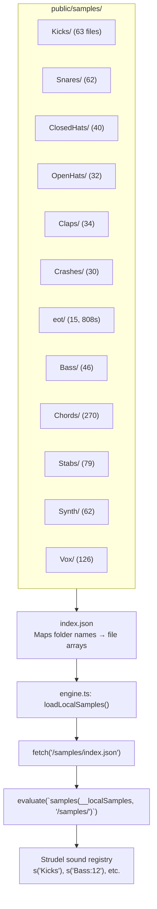
```mermaid
flowchart TD
    subgraph Folders ["public/samples/"]
        KICKS["Kicks/ (63 files)"]
        SNARES["Snares/ (62)"]
        CH["ClosedHats/ (40)"]
        OH["OpenHats/ (32)"]
        CLAPS["Claps/ (34)"]
        CRASHES["Crashes/ (30)"]
        EOT["eot/ (15, 808s)"]
        BASS["Bass/ (46)"]
        CHORDS["Chords/ (270)"]
        STABS["Stabs/ (79)"]
        SYNTH["Synth/ (62)"]
        VOX["Vox/ (126)"]
    end

    INDEX["index.json<br/>Maps folder names → file arrays"]

    Folders --> INDEX
    INDEX --> ENGINE["engine.ts: loadLocalSamples()"]
    ENGINE --> FETCH["fetch('/samples/index.json')"]
    FETCH --> EVAL["evaluate(`samples(__localSamples, '/samples/')`)"]
    EVAL --> STRUDEL["Strudel sound registry<br/>s('Kicks'), s('Bass:12'), etc."]
```

**Naming Convention**: Files are `FolderName_N.wav` (e.g., `Kicks_1.wav`, `Bass_42.wav`). Folder names are case-sensitive in Strudel.

---

## REST API Endpoints

### Chat API

| Method | Path | Purpose |
|--------|------|---------|
| POST | `/api/chat` | Claude proxy with SSE streaming |
| GET | `/api/health` | Server health check |

### Engine API

| Method | Path | Purpose |
|--------|------|---------|
| POST | `/api/engine/generate-drums` | Generate drum pattern |
| POST | `/api/engine/generate-bassline` | Generate bassline |
| POST | `/api/engine/generate-melody` | Generate melody |
| POST | `/api/engine/generate-complete` | Generate full composition |
| POST | `/api/engine/generate-variation` | Create pattern variation |
| POST | `/api/engine/generate-fill` | Generate drum fill |
| POST | `/api/engine/generate-polyrhythm` | Generate polyrhythm |
| POST | `/api/engine/scale` | Get scale notes |
| POST | `/api/engine/chord-progression` | Get chord progression |
| POST | `/api/engine/euclidean` | Generate euclidean rhythm |
| POST | `/api/engine/arpeggio` | Generate arpeggio |
| POST | `/api/engine/transform` | Apply transform (mood/energy/refine/etc.) |
| GET | `/api/engine/info` | List all available options |

---

## Technology Stack

```mermaid
mindmap
  root((AI Rack))
    Frontend
      React 18
      TypeScript
      Vite 6
      Zustand (state)
      CodeMirror 6 (editor)
      react-resizable-panels
      React Virtuoso (chat)
      Framer Motion (animation)
    Audio
      @strudel/web (engine)
      @strudel/soundfonts
      Meyda (analysis)
      Web Audio API
    Visuals
      hydra-synth (GPU shaders)
      Canvas 2D (events viz)
    Backend
      Express
      Anthropic SDK
      SSE streaming
    AI
      Claude Sonnet 4.6
      10 knowledge files
      11 tool definitions
      Music engine (theory + generation + transforms)
    Desktop
      Electron 33 (optional)
      electron-builder
```
